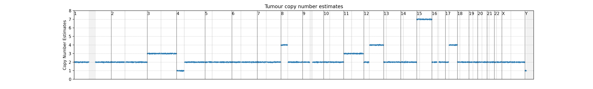
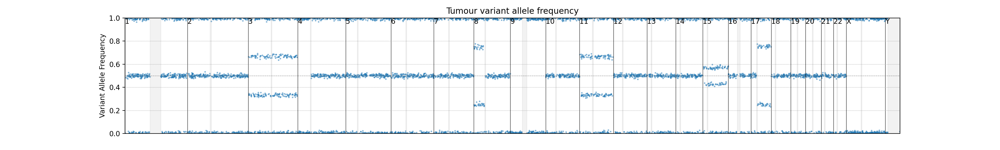
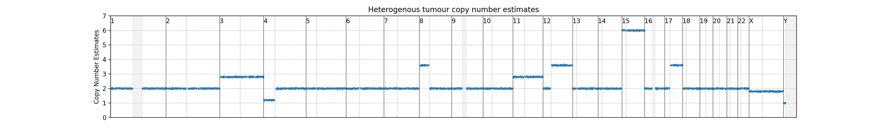
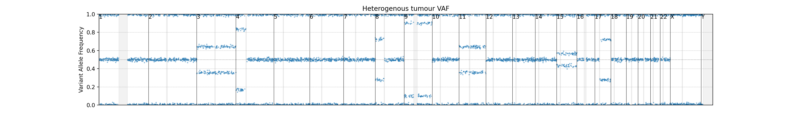

# **Genomics Assignment**


### **All questions must be answered in terms of the content covered during practicals and in other course materials provided unless noted otherwise. You must use tools and approaches covered during the practicals for all analysis. All analysis must be performed on your allocated VM in a directory named `~/Genomics`.**

Your submission should include:
- a single pdf file containing answers to all questions including screenshots requested, named axxxxxxx_GenomicsAssignment.pdf (replacing axxxxxxx with your student number). All screenshots must be clearly legible. Please ensure that this pdf file also includes your name and student number within the file.
- Two bash scripts named axxxxxxx_part3.sh and axxxxxxx_part4.sh for Sections 3 and 4 respectively (replacing axxxxxxx with your student number). 
- A mapped and sorted BAM file (for Section 3)
- the output file (`diploidSV.vcf.gz`) generated by Manta (for Section 3)
- A QUAST assessment/report (Section 4)


This assignment includes 90 possible marks which will be scaled to a mark out of 60.

## Section 1: Clinical Genomics - **15 marks**

1. List 5 annotations commonly added to a vcf that could be used to help filter down variants to a handful of diagnostic variants. Give a brief explanation of how each could help. **[2 marks]**  

2. You are helping a medical scientist find the disease-causing variant for a patient of Indigenous Australian descent. You find a variant in a candidate gene that matches the clinical phenotype, and look at its annotations to find its Gnomad frequency is 0.6%. What can the frequency of this variant tell you about the pathogenicity of the variant? **[1 mark]**

3. Referring to the case in question 2, you partner with ANU’s National Centre for Indigenous Genomics researchers (NCIG), who provide some more information on the variant in the disease-causing gene. They give you access to a database of 50,000 Indigenous individuals, and you count up the frequency of this variant and find it is now at a frequency of 8% in this new dataset. What can you infer from this? Choose one answer only. **[1 mark]**
	- a. Gnomad database has many more participants than 50,000, therefore the frequency is lower in Gnomad database than NCIG. 
	- b. Gnomad database does not have good representation of the Australian indigenous populations, hence the low frequency. Given this variant’s high frequency in the NCIG data, there is a good chance the variant belongs to benign private variation, rather than is pathogenic.
	- c. Regardless of its % in the NCIG database, the variant should be recommended to be classed as possibly pathogenic because it is <1% in Gnomad, since Gnomad is the gold standard resource. 
	- d. It is not possible to infer anything from this, since 50,000 is not a big enough sample size to calculate population frequency. 

4. What is a de novo mutation? **[1 mark]** 

5. What are the three hallmarks of a cnv event? Use either a deletion or duplication event as your example. **[1.5 marks]**


6. Is it possible to have an autosomal dominant homozygous mutation? Explain how. If you want to choose a few routine filters, would you set your variant curation software to filter by autosomal dominant homozygous mutation, or by autosomal dominant heterozygous? **[2.5 marks]**


7. You annotate 3 variants according to their Ensembl sequence ontology and want to perform some filtering based on effect on transcript. You find one is a “start retained” variant, one is “stop lost”, and the other is an “inframe deletion”. If you set your filtering to only keep variants with impact marked HIGH, which of them would be kept? **[1 mark]**

8. Refer to question 7 - based on effect on gene function, give the reasoning why you think each impact rating was attributed to each of the 3 ontology terms here. **[1.5 marks]**


9. When determing QC thresholds for determining if a sample should pass or fail, why is %bp covered at {threshold}X a better method than just overall mean depth? **[1 mark]**

10. Sex check, contamination check, and sample integrity are 3 important QC for each sample. Briefly describe how they can be done. **[1.5 marks]**

11. Why is validation and reproducibility so important in clinical pipelines? **[1 mark]**


## Section 2: Population Genomics - **20 marks**

1. What command would you use to get the total number of variants from a VCF called file.vcf.gz? And then only for the region 10,000,000-30,000,000 from chromosome 3? **[2 marks]**

2. What information would the command bcftools query -l file.vcf.gz give you? (Look at the bcftools documentation for a complete list of options) **[1 mark]**

3. If a VCF file has GT:GQ:DP:GL in the FORMAT field for a particular variant, what kind of information about the samples is recorded? **[2 marks]**

4. Which of the following programs can convert a VCF file into data formats compatible with population genomics analyses? **[2 marks]**
	- a. PLINK
	- b. ADMIXTOOLS
	- c. CONVERTF
	- d. SMARTPCA

5. What was the extension of the three output files when you converted a VCF file using PLINK? Describe briefly what information is recorded in each file. **[3 marks]**

6. When using PLINK, what would the option --maf 0.10 do? (Look at the PLINK documentation for a complete list of options... and use the search box!) **[2 marks]**

7. The three EIGENSTRAT output files generated when converting VCF files with CONVERTF contain information about the genotypes, variants, and samples. How is the genotype information coded? Briefly describe each code key (4 in total). **[2 marks]**

8. Data missingness is characteristic of ancient DNA datasets and could lead to biases when building a PCA. If you use SMARTPCA on a dataset that includes both contemporary (no missing data) and ancient genotypes (missing data), what options can you use to avoid biases due to missing data? **[2 marks]**

9. When using population genomics data, PCA (select the correct answer): **[1 mark]**
	- a. is a formal test of shared ancestry between populations
	- b. should only be used as an exploratory tool to visualise genetic diversity and formulate hypotheses about population ancestry
	- c. a and b are correct
	- d. a and b are wrong

10. F and D statistics allow us to test hypotheses about populations ancestry: **[1 mark]**
	- a. True
	- b. False

11. You performed a F4 or a D statistic and the result is not significantly different from 0. What does it mean in terms of genetic admixture? **[2 marks]**


## Section 3: Structural Variation - **20 marks**

Data for this part is located in the `/data/assignment3/` directory

### Copy number variation

**3.1.** The figure below shows the copy number estimates for various genomic regions inside a hypothetical human tumour sample. List all the copy number variations that you can see in the figure. **[2 marks]**




**3.2.** Similarly, the figure below shows the variant allele frequency of variants inside another hypothetical tumour sample. List all the CNVs that you can see from this figure. **[2 marks]**




**3.3.** Interpret the figures in the previous two questions together as being from the same sample. List the CNVs that you can see by integrating both data sets. **[2 marks]**


**3.4.** The figures in Questions 1 and 2 above are from an hypothetical "pure" tumour sample but in practice, we often get tumour samples which are mixed with some normal/non-tumourous cells. For example, for the same tumour sample, a percentage of normal cells have been included in the data, and the CN estimates and VAF graphs now look like the figures below. Estimate tumour purity of the sample from these figures. **[2 marks]**






**3.5.** What do the grey bars in the figures above represent? Why do they not contain any data points? **[1 mark]**

**3.6.** If we suspect that p-arm of chromosome 8 has fused with the q-arm of chromosome 17. How will you be able to determine whether a fusion event has occured? Will short-read NGS data (WGS, WES or RNA-seq) be able to detect such a fusion event? **[1 mark]**


### Data processing

**3.7.** Using symlinks to the data located in `~/data/assignment3/Q2` (listed below) , write a BASH script to do the following: **[6 marks]**

	- **a.** Use `bwa` to index the `mappabale_region.fasta` file. This is your reference sequence.
	- **b.** Map the paired-end FASTQ set (`sample_R1.fastq.gz` and `sample_R2.fastq.gz`) to the indexed reference above. Remember the output should be in BAM format, and needs to be sorted and indexed.
	- **c.** Use `manta` to call structural variation on this set of data.


The files located in `~/data/assignment3/Q2` are: 

```
sample_R1.fastq.gz
sample_R2.fastq.gz
mappable_region.fasta
mappable_region.fasta.fai
```

Your final submission **must** include:
* the BASH script
* the mapped and sorted BAM file
* the output file (`diploidSV.vcf.gz`) generated by Manta


**3.8.** By either examining the read data on IGV or by interpreting manta output, do the following: **[4 marks]**
	- **a.** Locate and list any breakpoints you can see in the data
	- **b.** Identify all SV events and their associated breakpoints. Show the steps and reasonings for your answers. Include diagrams if you think it helps. If you want to use hand-drawn diagram, just take and submit a photo of your drawing, but make sure it's clearly legible.


## Section 4: Eukaryotic genome assembly - **35 marks**

In this part, you aim is to de novo assemble one of the SMALLEST eukaryotic genomes, Encephalitozoon intestinalis. E. intestinalis belongs to Microsporidia, and it's a parasite (microbial fungi), which causes microsporidiosis (an oppotunistic intestinal infection that causes diarrhea and wasting in immunocompromised individuals, such as HIV). If you want to understand more about E. intestinalis, please hava a read at [wikipedia](https://en.wikipedia.org/wiki/Encephalitozoon_intestinalis). 

Although the genome of E. intestinalis is very small (~2.5 Mb), it has 11 chromsomes. If you want to know more about the genome statistics of E. intestinalis, please have a look at [here](https://www.ncbi.nlm.nih.gov/data-hub/genome/GCA_024399295.1/).

### Data

You are provided with 8 fastq files containing sequencing reads using different sequencing platforms. These fastq files can be found in `~/data/assignment2/raw_data` folder and are described in the table below:

| File(s)                                    | Platform | Coverage | Description                                            |
|--------------------------------------------|----------|----------|--------------------------------------------------------|
| illumina_SR_30x_1.fq, illumina_SR_30x_2.fq | Illumina | ~30x     | Paried-end short reads from Illumina Miniseq           |
| nanopore_LR_15x.fq                         | Nanopore | ~15x     | Long reads from Nanopore MinION                        |
| nanopore_LR_15x_filt.fq                    | Nanopore | ~15x     | Long reads (reads >= 10 kb) from Nanopore MinION       |
| nanopore_LR_30x.fq                         | Nanopore | ~30x     | Long reads from Nanopore MinION                        |
| pacbio_LR_15x.fq                           | PacBio   | ~15x     | Long reads from PacBio_SMRT Sequel II                  |
| pacbio_LR_15x_filt.fq                      | PacBio   | ~15x     | Long reads (reads >= 10 kb) from PacBio_SMRT Sequel II |
| pacbio_LR_30x.fq                           | PacBio   | ~30x     | Long reads from PacBio_SMRT Sequel II                  |

The original dataset can be found [here](https://www.ncbi.nlm.nih.gov/sra?linkname=bioproject_sra_all&from_uid=594722).

The illumina dataset will be used to do genome survey analysis (genome size estimation), and then you will be generating an assembly from each of six long reads datasets using Flye (v2.8.1) and then comparing the quality of these assemblies.

You are also provided with the E. intestinalis reference (taken from [here](https://www.ncbi.nlm.nih.gov/data-hub/genome/GCA_024399295.1/) if you want to have a look). 

It is in the `~/data/assignment2/DB` directory and is called `GCA_024399295.1_ASM2439929v1_genomic.fna`. 

In addition to the sequencing files, you will be also given two scripts which will be used to do sequence/genome statistics and genome survey analysis. These two scripts can be found in folder `~/data/assignment2/bin`, and are:

| Script       | Description                                 | Link                                               |
|----------------|---------------------------------------------|----------------------------------------------------|
| assembly-stats | A light tool to do basic genome statistics  | https://github.com/sanger-pathogens/assembly-stats |
| genomescope.R  | A R script to do genome survey analysis     | https://github.com/schatzlab/genomescope           |


### Questions

**4.1** Run `assembly-stats` on each LR (Long Reads) dataset and find out the following info for each dataset:

* total number of bases **[1 mark]**
* number of reads **[1 mark]**
* average read length **[1 mark]**
* largest read length **[1 mark]**

**4.2** Predict which datasets will produce the best and worst assemblies. 
Don't worry if your predictions don't match up with your results later. 
Just try to justify your predictions based on the information you've collected and your current knowledge. **[2 marks]**

**4.3** Use `jellyfish` and `genomescope.R` to perform genome survey analysis. What is the estimated genome size? Provide the generated figure showing the fitted model for k-mer distribution in your report (Hint: plot.png in your genomescope output folder) **[4 marks]**


**4.4** Write a bash script to assemble all 6 LR datasets using Flye. (Hint: Assembly all 6 LR datasets will take ~50 mins in total, so be patient if you see the Flye is running for a while.) Provide this bash script, named axxxxxxx_part4.sh, as part of your submission. **[5 marks]**

**4.5** Run `assembly-stats` on each assembled genome and find out the following info for the assembled genomes:

* draft genome size **[1 mark]**
* number of contigs **[1 mark]**
* largest contig length **[1 mark]**
* N50 **[1 mark]**

**4.6** Compare these assemblies with each other using QUAST and provide the report (Hint: report.pdf in your QUAST output folder). This may be uploaded separately to the pdf containing your answers to other questions. **[2 marks]**

**4.7** Comment on the contig length distribution. Is this what you expected? **[2 marks]**

**4.8** Explain why contiguity isn't a good measure of assembly accuracy but is still relevant to the overall assessment of assembly quality. **[2 marks]**


**4.9** Run BUSCO on your 6 assemblies using an appropriate lineage and create a comparison image using the `generate_plot.py` script. Note that this script will only work when the `BUSCO` conda environment is activated. Provide this image as a figure in your report (Hint: the "busco_figure.png" file in short summaries folder). **[4 marks]**

**4.10** Comment on the BUSCO results. Which assembly appears to be the best and which is the worst? **[2 marks]**


**4.11** Considering your findings so far, justify which assembly you think is the best and which is the worst.
If your findings don't match your predictions from Part 1, try to explain why this might be. **[4 marks]**

