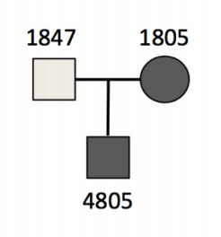

# Clinical Genomics Practical: Part 2 Variant Filtering and Pedigree Analyses


#### By Evelyn Collen
(Prac repurposed from the excellent Julien Soubrier)

## **1. Some background**

Last prac, we annotated a bunch of information into a vcf and learnt about the functional reasons behind the annotations. Variant filtering (also called variant priorisation) then gets us down to a handful of candidates based on applying logic to that functional information - and then, if the evidence is strong enough, we can report out our diagnostic variant (this is called the variant curation process).

Some well-known Mendelian genetic disorders, with single-gene causes such as sickle-cell anemia, Tay–Sachs disease and cystic fibrosis, can be relatively straightfoward to diagnose. However, often it's a lot more complex than a single gene with a well-characterised mutation. Not only that, the diagnostic variant we are searching for has be to sifted out 3 billion base pairs' worth of possible variation!


Today we will be looking at some common variation filtering and curation methods. We're going to be focussing on family inheritance patterns. Modes of inheritance can provide some good logic to help us match the patterns of variant inheritance to the patterns of phenotype inheritance that we observe in the patient's family. For example, does mum or dad carry the condition? Is it a _de novo_ mutation, that may have arisen in the patient, independently of their parents?


As you may have noticed, the three samples sequenced in our data are related to each other, and form a "trio" (mother-father-son). Trios are a very standard approach in clinical genetics, and are especially common for prenatal testing.

### 1.1 Reminder about virtual Machines

As usual we will be connecting the virtual machines: 

**Please ([go here](https://university-of-adelaide-bx-masters.github.io/Fundamentals_of_Bioinformatics/Course_materials/vm_login_instructions.html)) for instructions on connecting to your VM.**

### 1.3 Learning Outcomes

1. Learn about SQL databases and running basic SQL commands
2. Learn about the logic behind filtering out non-diagnostic variants (e.g. too common in population databases)
3. Learn about how modes of inheritance can help in filtering
4. Learn about population databases and filtering out common variants
5. Get an idea of using Gemini and pulling info about variants from a database format
6. Find diagnostic variant candidate(s) for hypolipoproteinemia in an affected trio


### 1.4 This week's tutorial

This week's tutorial is liberally taken from some tutorials written by Aaron Quinlan & his group at University of Utah, and introduces us the variant priorisation software 'Gemini'.

- [Identifying dominant gene candidates with GEMINI](https://s3.amazonaws.com/gemini-tutorials/Gemini-Dominant-Tutorial.pdf)


There are a lot of variant prioritisation programs similar to this one including Variantgrid, Emedgene, Franklin, and many others. Several are using AI under the hood, although because of the dynamism that comes with AI continuously updating itself, they can be very tricky to incorporate into clinical work (that needs to be rigourously validated). 

[Gemini](https://gemini.readthedocs.io/en/latest/) is a database system that can read in VCF information and family/pedigree information, to enable database querying and clinical genetics analyses.
Information in gemini is stored in a database system called SQL.
SQL stands for Structured Query Language, and is a SUPER popular database system in many industries.
It comes in many flavours that you might have heard before, including `MySQL`, `SQLite` and `PostgreSQL`.

Let's create and activate a conda environment with Gemini installed.
First go to the working directory we created last prac (uncomment and run the first two commands, if your ~/clinical_genomics directory doesn't already exist):

```bash
#mkdir -p ~/clinical_genomics && cd $_
#cp /shared/data/clinical_genomics/*  ~/clinical_genomics/
cd ~/clinical_genomics
```

Activate a conda environment with Gemini installed, and check we can use Gemini:

```bash
source activate geminiEnv

gemini -h
```

### 1.5 Cohort databases

Let's make some databases!
Gemini can take the VCF file and sample information in the form of a ped file (short for pedigree).
The ped file is actually a standard metadata information file that was developed in the age of population genetics and GWAS analyses.


Unfortunately, the database loading command also adds a lot of annotation information with high memory requirements, so let's use a pre-generated database: ___trio.trim.vep.dominant.db___

The command you would have had to run is here for your info:

```bash
# Loading VCF files require all the annotation databases
## Cmd to create the gemini db for dominant study
#gemini load --cores 4 -v trio.trim.vep.vcf.gz -t VEP \
#        --skip-gene-tables -p dominant.ped trio.trim.vep.dominant.db
```

We'll use this database for our querying, and our `autosomal_dominant` analysis.

### 1.6 Querying a SQL database in Gemini

First - here's some quick points on SQL and examples on how to use SQL queries. 

In SQL, information is stored in tables, much like a sheet within a Microsoft Excel Spreadsheet file.
You can ask the database to give you specific, tabular information and also put restrictions on the type of information that you are requesting (such as a conditional like "the sex of the person must be female").

If you are interested, you can find a lot more info on [standard SQL commands](https://www.codecademy.com/articles/sql-commands).

For this prac, we only need to know how to query the database using the `SELECT` and `FROM` command.
We will also need some conditionals like `WHERE`, `IS`, `IS NOT` etc. 

Let's have a look at what we have in the database file:

```bash
gemini db_info trio.trim.vep.dominant.db
```

As you can see, we have a number of tables. Within those tables we have columns.
And the data within those columns has a specific data type, all of which we can query.

Let's look at some examples by using the `gemini query` sub-command.

```bash
# Get everything from the samples table with a wildcard
gemini query -q "SELECT * FROM samples" trio.trim.vep.dominant.db

# Get the names of the individuals from the samples table
gemini query -q "SELECT name FROM samples" trio.trim.vep.dominant.db

# Get the names of the individuals from the samples table that are male
gemini query -q "SELECT name FROM samples WHERE sex IS 1" trio.trim.vep.dominant.db

# Get the names of the individuals from the samples table that are male and European
gemini query -q "SELECT name FROM samples WHERE sex IS 1 AND ancestry is 'CEU'" trio.trim.vep.dominant.db


# Get the names of the individuals from the samples table that are male
gemini query -q "SELECT name FROM samples WHERE sex == 1" trio.trim.vep.dominant.db

# Get the names of the individuals from the samples table that are not female
gemini query -q "SELECT name FROM samples WHERE sex IS NOT 2" trio.trim.vep.dominant.db

# Get the names and sex of the individuals from the samples table that not female (less than '2', our code for female)
gemini query -q "SELECT name, sex FROM samples WHERE sex < 2" trio.trim.vep.dominant.db
```

Note: Depending on the data type, you may need to surround character info in ''. 


---
### **Questions:**

---

#### Build your query
Now that we know the query structure and tables that we have in our database, let's construct some more sophisticated queries.
1. Extract the chromosome and position (SELECT chrom, start) of all variants in the database ("FROM variants") that have a '1000 Genome Project' allele frequency in Europeans (aaf_1kg_eur) less than 0.5 (Hint: the construction is similar to the last example given above) How many are there?
2. Extract all the variants (chrom, start, end, ref, alt, qual) within the gene MAPK12 that have a variant quality > 200 (you will need an AND statement, again you can take a look example above how that is constructed). How many are there? How many are QUAL > 500?
3. Extract variant info (chrom, start, end, ref, alt, qual) and genotype (gts) for the rsID rs774794409. You will need to pull the variant where the rs_ids column matches this rsID. Does the trio (mum, dad and son) all carry the same genotype for this variant?
4. Can you think how could find out which gene that rsID variant is in, just from querying the database?


---

<details>
<summary>Answers</summary>
1.<br>

<pre><code class="language-bash">

gemini query -q "SELECT chrom, start FROM variants WHERE aaf_1kg_eur < 0.5" trio.trim.vep.dominant.db | wc -l

</code></pre>

There are 12002<br>


2.<br>

<pre><code class="language-bash">

gemini query -q "SELECT chrom, start, end, ref, alt, qual FROM variants WHERE gene = 'MAPK12' AND qual > 200" trio.trim.vep.dominant.db | wc -l

</code></pre>

There are 10 with qual > 200

<pre><code class="language-bash">

gemini query -q "SELECT chrom, start, end, ref, alt, qual FROM variants WHERE gene = 'MAPK12' AND qual > 500" trio.trim.vep.dominant.db | wc -l

</code></pre>

There are 9 with qual > 500

3.<br>

<pre><code class="language-bash">

gemini query -q "SELECT chrom, start, end, ref, alt, qual, gts FROM variants WHERE rs_ids = 'rs774794409'" trio.trim.vep.dominant.db 

</code></pre>

Output:<br>

chr22   50691919        50691920        T       G       1543.93005371   T/G,T/G,T/G

By chance, all 3 family members carry the same het genotype for this variant!

4.<br>

Yes you can select the gene column from the table:

<pre><code class="language-bash">

gemini query -q "SELECT gene FROM variants WHERE rs_ids = 'rs774794409'" trio.trim.vep.dominant.db 
```

MAPK12

</code></pre>

</details>

## **2. Autosomal Dominant disorders**

Autosomal dominant disorders are genetic disorders that do not involve the sex chromosomes and are passed down through families in a vertical transmission pattern. 
Incomplete penetrance can occur within the family, meaning that the disorder may not always show phenotypically.
`Penetrance` here means "the extent to which a particular gene or set of genes is expressed in the phenotypes of individuals carrying it, measured by the proportion of carriers showing the characteristic phenotype."


Examples of these disorders include Huntington disease, neurofibromatosis, and polycystic kidney disease, and there are many more.

The trio that we will be looking at today is affected by a rare disorder called [_hypobetalipoproteinemia_](https://ghr.nlm.nih.gov/condition/familial-hypobetalipoproteinemia), a disorder that impairs the body's ability to absorb and transport fats.
It occurs in about in 1 in 1,000 to 3,000 individuals (1 in ~1,000 in Europeans, which is relevant as this is a European family).



Both the mother (`1805`) and the son (`4805`) are affected with the disorder. Although they have normal plasma HDL, they suffer from fat malabsorption and are in the bottom 5% for plasma cholesterol and triglycerides.

We want to be able to see these sort of relationships in the PED file so lets have a quick look:

```bash
cat dominant.ped | column -t

#family_id  sample_id  paternal_id  maternal_id  sex  phenotype  ancestry
family1     1805       -9           -9           2    2          CEU
family1     1847       -9           -9           1    1          CEU
family1     4805       1847         1805         1    2          CEU
```

As you can see, all of the relationships between the individuals are recorded in the PED file, including the sex of the individuals and the prevalence of the phenotype. -9 means NA here.
When sampling larger families, or even populations, all of the unique inheritance patterns can be recorded here and used to inform the clinical model when it comes to identifying candidate genes or variants for the disorder.

### 2.1 Sample genotype queries

Given that we will be comparing the pattern of inheritance of these variants, it's easy to filter variants so that we can pick up specific relationships between individuals.
For example, what if we wanted to identify variants where both 1805 (mum) and 4805 (son) have a non-reference allele?
(After all, 1805 and 4805 are both affected, so this seems likely!)

```bash
# Show all info
gemini query -q "SELECT * from variants" \
            --gt-filter "(gt_types.1805 <> HOM_REF AND gt_types.4805 <> HOM_REF)" \
            --header \
            trio.trim.vep.dominant.db | head

# Print just the genotypes to compare
gemini query -q "SELECT gts.1805, gts.4805 from variants" \
            --gt-filter "(gt_types.1805 <> HOM_REF AND gt_types.4805 <> HOM_REF)" \
            --header \
            trio.trim.vep.dominant.db | head
```

Or how about using a wildcard with the `--gt-filter` to identify all heterozygous variants.
The syntax for wildcards in `--gt-filter` follows a slightly different format:

```--gt-filter (COLUMN).(SAMPLE_WILDCARD).(SAMPLE_WILDCARD_RULE).(RULE_ENFORCEMENT)```

```bash
# Print heterozygous variants in all samples
gemini query -q "SELECT chrom, start, end, ref, alt, gene, impact, (gts).(*) \
                 FROM variants" \
            --gt-filter "(gt_types).(*).(==HET).(all)" \
            --header \
            trio.trim.vep.dominant.db | head

# Print variants where all the female variants are reference homozygous
gemini query -q "SELECT chrom, start, end, ref, alt, gene, impact, (gts).(*) \
                 FROM variants" \
            --gt-filter "(gt_types).(sex==2).(==HOM_REF).(all)" \
            --header \
            trio.trim.vep.dominant.db | head
```

You can add different quality filters for each of the genotypes, and also look at variant depth and quality in each genotype by using `gt_depth` and `gt_quals`.

### 2.2 Using the `autosomal_dominant` tool

Gemini already comes with a number of tools that allow you to assess particular types of clinical genetic patterns, including one for autosomal dominant disorders.
This tool has the known characteristics of this type of genetic disorder hard-coded into the function.
The genotype requirements for an autosomal dominant disorder are:

1. All affected individuals must be a heterozygous variant. 
   - After all one copy comes from mum and the other from dad
   - One of which is defective
2. No unaffacted can be heterozygous or homozygous alternate
   - However they can be unknown
3. Can't be `de-novo` mutations (i.e., can't be any variants not seen in mum and/or dad)
4. Affected individual must have an affected parent
5. All affecteds must have parents where the phenotype is known
   - Otherwise throw a warning

Let's have a look at it:

```bash
gemini autosomal_dominant \
    --columns "chrom, start, end, ref, alt, gene, impact, cadd_raw" \
    trio.trim.vep.dominant.db | head | column -t
```

---
### **Question:**
---

Can you figure out how many variants have an autosomal dominant inheritance pattern for this family? (Hint: you need to remove the header, and can do this if you pipe into 'tail -n +2').

---

<details>
<summary>Answers</summary>
Yes, we can count the lines and find the number of variants is 1541:<br>


<pre><code class="language-bash">

gemini autosomal_dominant \
    --columns "chrom, start, end, ref, alt, gene, impact, cadd_raw" \
    trio.trim.vep.dominant.db | tail -n +2 | wc -l

</code></pre>

</details>


Let's take a moment to think what we are doing here - we just ran the `autosomal_dominant` tool, and extracting specific columns of information from the database, printing only the first few lines and separating them out into tab delimited columns so we can see whats going on. Then you counted up how many variants carry an autosomal dominant pattern - and it's quite a lot!

To help us filter down more, next we want to include the important information like whether the variant is in a gene, what the impact of the variant is, and whats the pathogenicity of that variant (using the raw CADD score annotation, if you remember back from last prac).

From here we can continue the variant filtering process to a few candidates, then 'curate' them to the most likely diagnostic causal one. For example, we can filter out any variants that did not pass genotype calling filters, and count how many pass:

```bash
gemini autosomal_dominant \
 --columns "chrom, start, end, ref, alt, gene, impact, cadd_raw" \
 --filter "filter is NULL" \
trio.trim.vep.dominant.db \
| tail -n +2 | wc -l
```

Now we have gotten down to 1303 variants!


---
### **Questions:**

---
#### Find candidate variants for Hypobetalipoproteinemia

1. Generate a list of the variants that have 'HIGH' and 'MODERATE' impact (tip: you can try "filter is NULL and impact_severity != 'LOW'" to get all the variants that are high and moderate impact). How many do we now have?
2. Build up some additional filters:
  - The variant is likely to be rare, so it might be good to only keep variants with allele-frequencies < 0.01 in specific populations. Given this family's ancestry, European Americans and mostly European databases are good populations to try - you could even try both together (syntax you need is aaf_esp_ea < 0.01 and aaf_exac_all < 0.01, added to the other filters).
  - what if we change the impact severity to only high (the syntax you need here is 'impact_severity == 'HIGH'). How many variants do we get down to?
    
3. Generate a list of candidate genes based on the filters you have built. Do a quick search for these genes' function on [GeneCards](https://www.genecards.org/). Do any of them fit the phenotype of hypobetalipoproteinemia?

---

<details>
<summary>Answers</summary>
1.<br>

<pre><code class="language-bash">

gemini autosomal_dominant \
 --columns "chrom, start, end, ref, alt, gene, impact, cadd_raw" \
 --filter "filter is NULL and impact_severity != 'LOW'" \
trio.trim.vep.dominant.db \
| tail -n +2 | wc -l

</code></pre>

Number of variants is now 338<br>

2.
<pre><code class="language-bash">

 gemini autosomal_dominant \
 --columns "chrom, start, end, ref, alt, gene, impact, cadd_raw" \
 --filter "filter is NULL and impact_severity == 'HIGH' and aaf_esp_ea < 0.01 and aaf_exac_all < 0.01" \
trio.trim.vep.dominant.db \
| tail -n +2 | wc -l

</code></pre>

We get down to 2! Yay!<br>


3. The output from gemini gives us the following:<br>

<pre><code class="language-bash">

 gemini autosomal_dominant \
 --columns "chrom, start, end, ref, alt, gene, impact, cadd_raw" \
 --filter "filter is NULL and impact_severity == 'HIGH' and aaf_esp_ea < 0.01 and aaf_exac_all < 0.01" \
trio.trim.vep.dominant.db

</code></pre>

| chrom | start | end | ref | alt | gene | impact | cadd_raw | variant_id | family_id | family_members | family_genotypes | samples | family_count |
|---|---:|---:|---|---|---|---|---|---:|---|---|---|---|---:|
| chr2 | 21236250 | 21236251 | G | A | APOB | stop_gained | None | 492 | family1 | 1805(1805;affected;female),1847(1847;unaffected;male),4805(4805;affected;male) | G/A,G/G,G/A | 1805,4805 | 1 |
| chr22 | 21363743 | 21363744 | T | C | TUBA3FP | splice_acceptor_variant | None | 15272 | family1 | 1805(1805;affected;female),1847(1847;unaffected;male),4805(4805;affected;male) | T/C,T/T,T/C | 1805,4805 | 1 |<br>

If we have a quick look on genecards - we find that the APOB gene codes for a protein that is 'the main structural apolipoprotein of chylomicrons and low-density lipoproteins'. This perfectly explains our phenotype, and the mode of inheritance totally fits. The other gene, TUBA3FP, does not fit the output so well. <br>

If this was a real life case, we could go ahead and issue a report for this, which would go to the clinician. Hopefully finding this variant can allow for the better management and treatment of this patient's condition.

</details>


### Conclusion

Well done, we found the earring! In the real world of clinical genetics, it's not always this straightfoward, and there are many, many cases where no clear diagnostic variant can be found. But the field is super fast moving, and we never give up - for patients where no clear diagnosis is found, we can help them enroll in related research studies, or we can wait and perform reanalyses (sometimes it takes up to years later) once there is better gene information and/or better techniques. 